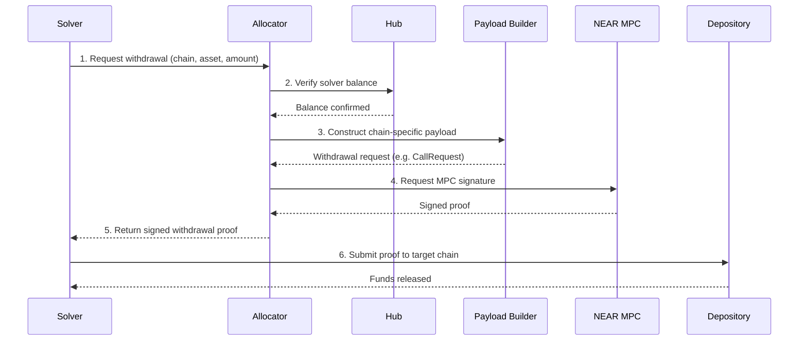

## Overview

The Allocator is the component responsible for authorizing withdrawals from [Depository](/references/protocol/components/depository) contracts. When a solver wants to claim funds they've earned by filling orders, the Allocator verifies their [Hub](/references/protocol/components/hub) balance and generates a cryptographic proof that the Depository will accept.

The Allocator uses **MPC (Multi-Party Computation) chain signatures** via the NEAR protocol, meaning no single entity holds the private keys needed to authorize withdrawals.

## How It Works

The withdrawal authorization process:

1. **Solver requests withdrawal** — The solver specifies the target chain, asset, and amount they want to withdraw

2. **Balance check** — The Allocator reads the solver's balance on the Hub to confirm sufficient funds are available

3. **Payload construction** — A chain-specific **Payload Builder** constructs the withdrawal request in the format the target chain's Depository expects

4. **MPC signing** — The Allocator requests an MPC signature from the NEAR chain signatures network. This generates a valid signature without any single party having access to the full private key

5. **Proof delivery** — The signed withdrawal proof is returned to the solver, who submits it to the Depository contract on the target chain

## Payload Builders

Different chains require different transaction formats. The Allocator uses specialized Payload Builders for each chain type:

| Builder | Chains | Signature Format |
|---------|--------|------------------|
| **EVM Payload Builder** | Ethereum, Base, Arbitrum, Optimism, + all EVM chains | EIP-712 typed data |
| **Solana Payload Builder** | Solana, Eclipse, Soon | Ed25519 |
| **Bitcoin Payload Builder** | Bitcoin | ECDSA (secp256k1) |
| **Sui Payload Builder** | Sui | Ed25519 |

Each Payload Builder constructs the chain-specific request structure (e.g., `CallRequest` for EVM, `TransferRequest` for Solana) with the appropriate encoding (ABI for EVM, Borsh for Solana).

## Security Model

The Allocator is a trust-critical component — it controls access to funds in the Depository. Several safeguards protect against misuse:

### MPC Chain Signatures

The Allocator's signing keys are managed through NEAR's MPC chain signatures. This means:

- **No single key holder** — The private key is split across multiple MPC nodes, and a threshold must cooperate to produce a signature
- **Programmable authorization** — The Allocator is a smart contract that can enforce rules (balance checks, rate limits) before requesting a signature
- **Auditable** — All signing requests go through an onchain contract, creating a transparent record

### Replay Protection

Every withdrawal proof includes:

- **Nonce** — A unique, incrementing value that prevents the same proof from being used twice
- **Expiration** — A timestamp after which the proof is no longer valid, preventing stale proofs from being used

### Security Council

The Allocator is governed by a **Security Council** — a multisig composed of multiple independent parties across different timezones. The Security Council can:

- **Pause** the Allocator (1-of-N threshold) — Any member can immediately halt withdrawals in an emergency
- **Unpause** the Allocator (majority threshold) — Resume operations after a pause
- **Replace** the Allocator (supermajority threshold) — Set a new Allocator in case of a bug or required upgrade
- **Change membership** (supermajority threshold) — Add or remove Security Council members

### Global Pause

Because all withdrawals across all chains flow through a single Allocator, the entire protocol can be paused with a single transaction. This is a significant security advantage over protocols where escrow contracts on each chain must be paused individually.

<Warning>
The Allocator cannot mint new balances or alter the Hub ledger. It can only authorize withdrawals up to a solver's existing Hub balance. Even a compromised Allocator cannot create funds that don't exist.
</Warning>

## Source Code

The Allocator contract (`RelayAllocator.sol`) is part of the [`settlement-protocol`](https://github.com/relayprotocol/settlement-protocol) repository. It is deployed on Aurora (NEAR ecosystem) for direct integration with NEAR MPC chain signatures.
