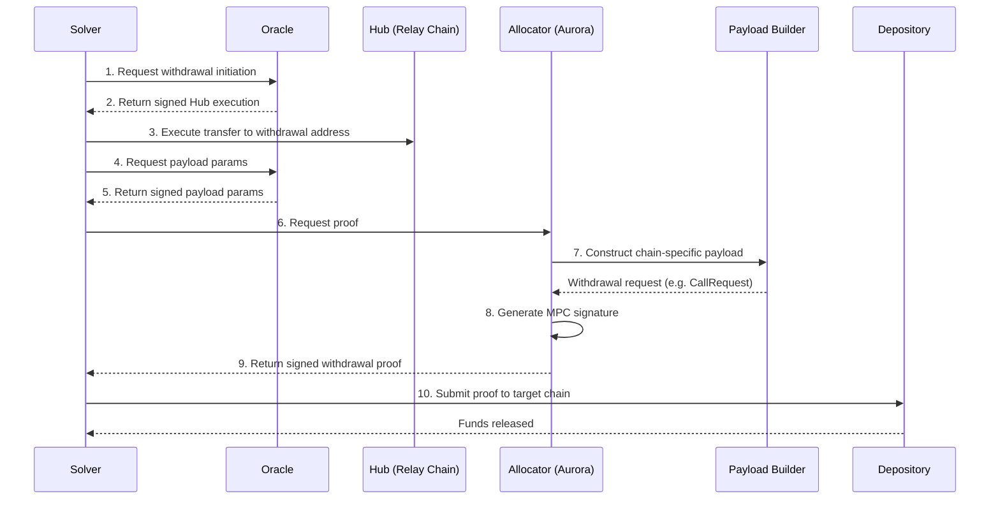

## Overview

The Allocator is the component responsible for authorizing withdrawals from [Depository](/references/protocol/components/depository) contracts. When a solver wants to claim funds they've earned by filling orders, the Allocator verifies their [Hub](/references/protocol/components/hub) balance and generates a cryptographic proof that the Depository will accept.

The Allocator uses **MPC chain signatures** for signing, meaning no single entity holds the private keys needed to authorize withdrawals. It is governed by the [Security Council](/references/protocol/components/security-council), which can pause or replace it in an emergency.

## How It Works

The withdrawal authorization process:

<Info>
While solvers are the primary users of the withdrawal flow, any address that holds a balance on the Hub can withdraw using the same mechanism.
</Info>

1. **Solver requests withdrawal initiation** — The solver requests a withdrawal from the [Oracle](/references/protocol/components/oracle), including the withdrawal parameters and owner authorization.

2. **Oracle returns Hub execution** — The Oracle computes the deterministic [withdrawal address](/references/protocol/components/hub#withdrawal-addresses) for the request and returns a signed execution that transfers the corresponding Hub balance to that address.

3. **Solver executes transfer on Hub** — The solver submits that execution on the Relay Chain so the withdrawal address now holds the requested Hub balance.

4. **Solver requests payload params** — Once the transfer is reflected on the Hub, the solver calls the Oracle again to obtain the signed payload parameters for the withdrawal.

5. **Oracle returns payload params** — The Oracle verifies the withdrawal address balance and returns the payload parameters that the Allocator flow will use.

6. **Payload construction** — A chain-specific **Payload Builder** constructs the withdrawal request in the format the target chain's Depository expects.

7. **MPC signing** — The Allocator requests an MPC signature from the NEAR chain signatures network. This generates a valid signature without any single party having access to the full private key.

8. **Proof delivery** — The signed withdrawal proof is returned to the solver, who submits it to the Depository contract on the target chain.

## Payload Builders

Different chains require different transaction formats. The Allocator uses specialized Payload Builders for each chain type:

| Builder | Chains | Signature Format |
|---------|--------|------------------|
| **EVM Payload Builder** | Ethereum, Base, Arbitrum, Optimism, + all EVM chains | EIP-712 typed data |
| **Solana Payload Builder** | Solana, Eclipse, Soon | Ed25519 |
| **Bitcoin Payload Builder** | Bitcoin | ECDSA (secp256k1) |
| **Sui Payload Builder** | Sui | Ed25519 |

Each Payload Builder constructs the chain-specific request structure (e.g., `CallRequest` for EVM, `TransferRequest` for Solana) with the appropriate encoding (ABI for EVM, Borsh for Solana).

## MPC Signing

The Allocator uses **Multi-Party Computation (MPC) chain signatures** for withdrawal authorization. Instead of a single private key controlling access to Depository funds, the signing key is split across multiple independent MPC nodes. A threshold of nodes must cooperate to produce a valid signature — no single entity ever holds the full key.

Key properties:

- **No single key holder** — The private key is split across multiple MPC nodes, and a threshold must cooperate to produce a signature
- **Programmable authorization** — The Allocator enforces rules (balance checks) before requesting any signature
- **Chain-agnostic** — MPC signing can produce signatures for any curve or format (ECDSA, Ed25519, etc.), enabling support for EVM, Solana, Bitcoin, Sui, and other VMs
- **Auditable** — All signing requests flow through an onchain contract, creating a transparent record

The protocol currently uses **NEAR MPC chain signatures** for its signing infrastructure. The Allocator contract is deployed on **Aurora** (NEAR ecosystem) for direct integration with the NEAR MPC network.

<Info>
The MPC signing layer is designed to be implementation-agnostic. While NEAR chain signatures are used today, the architecture allows for alternative MPC networks or signing backends without changes to the rest of the protocol.
</Info>

## Security Model

The Allocator is a trust-critical component — it controls access to funds in the Depository. Several safeguards protect against misuse:

- **[MPC signing](#mpc-signing)** — No single entity holds the full signing key. A threshold of independent MPC nodes must cooperate to produce a valid signature.
- **Balance-bounded** — The Allocator can only authorize withdrawals up to a solver's existing [Hub](/references/protocol/components/hub) balance. It cannot mint new balances or alter the ledger.
- **[Security Council](/references/protocol/components/security-council)** — A multisig that can pause all withdrawals with a single transaction, or replace the Allocator entirely.
- **Replay protection** — Every withdrawal proof includes a unique nonce and expiration timestamp, preventing reuse of stale proofs.

<Warning>
The Allocator cannot mint new balances or alter the Hub ledger. It can only authorize withdrawals up to a solver's existing Hub balance. Even a compromised Allocator cannot create funds that don't exist.
</Warning>

## Source Code

The Allocator contract (`RelayAllocator.sol`) is part of the [`settlement-protocol`](https://github.com/relayprotocol/settlement-protocol) repository.
