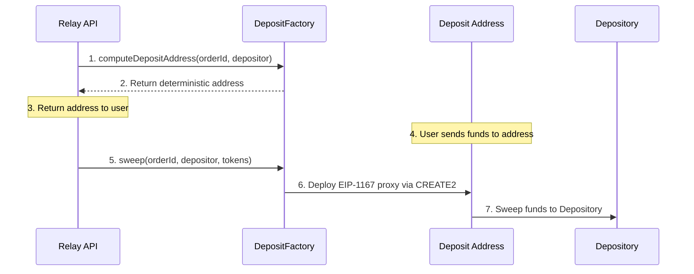

## Overview

Deposit Addresses allow users to bridge funds by sending tokens to a pre-computed address — no wallet connection, no calldata, and no approval transactions required. Under the hood, Relay uses **counterfactual smart contracts** to generate deterministic deposit addresses for each `(orderId, depositor)` pair. Funds sent to these addresses are swept into the [Depository](/references/protocol/components/depository) and attributed to the correct order and depositor.

This is powered by two contracts: a **DepositFactory** (deployed once per chain) and a **DepositSweeper** (a stateless implementation contract that proxies delegate to).

<Info>
For API integration details and usage examples, see the [Deposit Addresses feature guide](/features/deposit-addresses).
</Info>

## How It Works

The flow has three phases: address computation, deposit, and sweep.

### Address Computation

Each deposit address is deterministically derived from the **orderId** and **depositor** using CREATE2 and [EIP-1167](https://eips.ethereum.org/EIPS/eip-1167) minimal proxy clones. The factory computes a salt as `keccak256(orderId, depositor)`, so the address depends on the factory address, the implementation address, and that combined salt. This means the address can be computed **before any contract is deployed** there.

This is what makes deposit addresses "counterfactual" — the address is valid and can receive funds even though no contract exists at that address yet.

### Deposit

The user sends ERC20 tokens or native ETH directly to the computed address. No calldata is needed — a simple transfer is sufficient. The funds sit at the address until the sweep is triggered.

### Sweep

Once funds arrive, the Relay backend calls `sweep` on the DepositFactory. This atomically:

1. **Deploys** an EIP-1167 minimal proxy at the pre-computed address (using CREATE2)
2. **Calls** the proxy's `sweep` function via delegatecall to the DepositSweeper implementation
3. **Transfers** all funds from the deposit address into the Depository, tagged with the correct `orderId` and `depositor`

If the proxy has already been deployed (e.g., from a previous deposit for the same `(orderId, depositor)` pair), the factory calls `sweep` directly on the existing proxy — no redeployment needed.

## Contracts

### DepositFactory

The factory is deployed once per supported chain. It has two key functions:

- **`computeDepositAddress(orderId, depositor)`** — Returns the deterministic address where a user should send funds for a given order and credited depositor. This is a view function that requires no gas.
- **`sweep(orderId, depositor, tokens)`** — Sweeps funds from an already-deployed proxy. Used for re-sweeping if additional funds arrive after the initial sweep.

The factory holds two immutable references:
- **DEPOSITORY** — The Depository contract on that chain
- **IMPLEMENTATION** — The DepositSweeper implementation contract

### DepositSweeper

The sweeper is a stateless implementation contract. It is never called directly — instead, EIP-1167 minimal proxies delegate to it. When called via a proxy, it:

1. Reads the token balance at the proxy address
2. For **ERC20 tokens**: approves the Depository and calls `depositErc20(depositor, token, amount, orderId)`
3. For **native ETH**: calls `depositNative(depositor, orderId)` with the ETH value

The sweeper includes a `receive()` function to handle edge cases where ETH is sent to the proxy via `selfdestruct` or block rewards, preventing griefing attacks that could block proxy deployment.

## Multi-Token Support

A single deposit address can receive multiple token types. The `sweep` function accepts an array of token addresses, sweeping each one to the Depository in a single transaction. The zero address (`0x0000000000000000000000000000000000000000`) represents native ETH.

## Security

- **Deterministic and verifiable** — Anyone can independently compute a deposit address from the `orderId` and `depositor` and verify it matches what the API returned
- **Atomic operations** — `sweep` is atomic: if any part fails, the entire transaction reverts and funds remain safe at the deposit address
- **No approval risk** — Users send funds via simple transfers. No token approvals are granted to third parties
- **Non-upgradable** — Both the factory and sweeper are immutable contracts
- **Re-sweep safe** — If additional funds are sent to an address after the initial sweep, they can be recovered by calling `sweep` again

## Source Code

The DepositFactory and DepositSweeper contracts are part of the [`settlement-protocol`](https://github.com/relayprotocol/settlement-protocol) repository.
