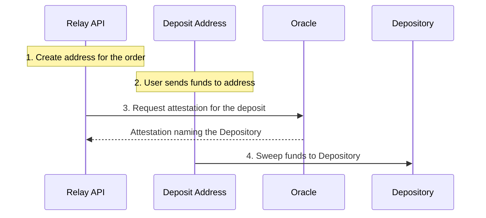

## Overview

Deposit Addresses let users bridge funds by sending tokens to an address, with no wallet connection, calldata, or approval transactions. Relay sweeps each deposit into the [Depository](/references/protocol/components/depository) for the order it funds. Fills and refunds then settle from the Depository like any other deposit.

<Info>
For API integration details and usage examples, see the [Deposit Addresses feature guide](/features/deposit-addresses).
</Info>

## How It Works

The flow has three phases: address creation, deposit, and sweep.

```mermaid
sequenceDiagram
    participant API as Relay API
    participant DA as Deposit Address
    participant O as Oracle
    participant D as Depository

    Note over API: 1. Create address for the order
    Note over DA: 2. User sends funds to address
    API->>O: 3. Request attestation for the deposit
    O-->>API: Attestation naming the Depository
    DA->>D: 4. Sweep funds to Depository
```

### Deposit

The user sends tokens directly to the address with a standard transfer. The funds stay at the address until they are swept.

### Sweep

When Relay detects a deposit, the [Oracle](/references/protocol/components/oracle) attests that the deposit is registered to an order and names the approved Depository. Relay then sweeps the deposited amount into that Depository.

If the sweep fails, the funds stay at the address and can be swept again. Refunds follow the same path: the funds are swept into the Depository first and then paid out to the refund address.

## Multi-Token and Multi-Deposit Support

A single address can receive several deposits and different supported tokens. Relay sweeps each deposit separately, with its own order. Tokens that aren't supported for deposit addresses are never swept.
