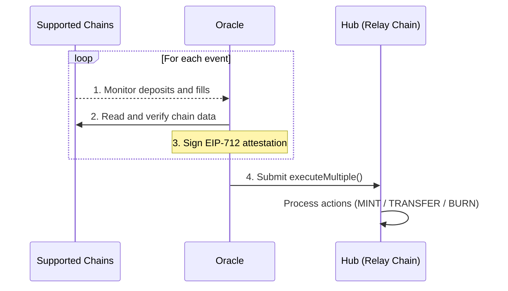

## Overview

The Oracle is the verification engine of the protocol. It reads events from origin and destination chains, verifies that deposits and fills occurred correctly, and submits signed attestations to the [Hub](/references/protocol/components/hub) on the [Relay Chain](/references/protocol/components/relay-chain).

Unlike push-based oracles that continuously stream data crosschain, Relay uses a **pull-based** model. The Oracle reads historical chain data on-demand when attestation is needed. This keeps costs low and avoids the overhead of maintaining persistent message channels to every chain.

## What the Oracle Attests

The Oracle can attest to four types of events:

### Deposits

When a user deposits into the [Depository](/references/protocol/components/depository) on an origin chain, the Oracle verifies the deposit occurred and attests it to the Hub. This triggers a **MINT** action, creating a token balance on the Hub that represents the deposited funds.

### Fills

When a solver fills a user's order on a destination chain, the Oracle verifies the fill matched the user's intent (correct destination, amount, and action). It attests this to the Hub as a **TRANSFER** action, moving the balance from the user to the solver.

### Reverts

If a solver fails to fill within the expected timeframe, the Oracle can attest a revert. This restores the user's balance on the Hub, allowing them to withdraw their original deposit.

### Withdrawals

When a solver claims funds from a Depository, the Oracle verifies the withdrawal occurred and attests it to the Hub as a **BURN** action, reducing the solver's Hub balance to stay in sync.

## Architecture

The Oracle operates as a multi-step pipeline:

1. **Monitor** — Watch for relevant events on supported chains (deposits, fills)
2. **Verify** — Read chain data to confirm the event details match expected values
3. **Sign** — Create an EIP-712 typed data signature over the attestation
4. **Submit** — Call `executeMultiple()` on the Oracle contract on the Relay Chain

The Oracle contract on the Relay Chain processes the signed attestation and calls the appropriate action on the Hub (MINT, TRANSFER, or BURN).

### Pull-Based Verification

A key cost optimization is that the Oracle does not require message-passing infrastructure (like LayerZero or Hyperlane) between chains. Instead:

- Validators read **historical chain data** on-demand, rather than continuously watching message inboxes
- Attestation requests are initiated and delivered on the Hub, meaning **no gas is spent on origin or destination chains** for verification
- This dramatically reduces the per-order cost of verification compared to protocols that emit and relay crosschain messages

### Batch Execution

The Oracle supports batch attestation via `executeMultiple()`. Multiple attestations (across different orders and action types) can be submitted in a single transaction on the Relay Chain, further amortizing gas costs.

If an individual attestation in a batch has already been processed, it is skipped rather than reverting the entire batch.

## Decentralization

The Oracle is designed to support a **consensus-based multi-operator model**, where multiple independent parties run oracle nodes and attestations require agreement from a threshold of operators. This eliminates any single point of trust in the verification process.

<Info>
The Oracle is a trust-critical component — it determines which deposits and fills are considered valid. However, it cannot steal funds. Even a compromised Oracle can only incorrectly attribute balances on the Hub. User funds in the Depository remain protected by the Allocator's withdrawal authorization.
</Info>

## Source Code

The Oracle contract is part of the [`settlement-protocol`](https://github.com/relayprotocol/settlement-protocol) repository. The contract is deployed on the Relay Chain and can be viewed on the [Relay Chain Explorer](https://explorer.chain.relay.link).
