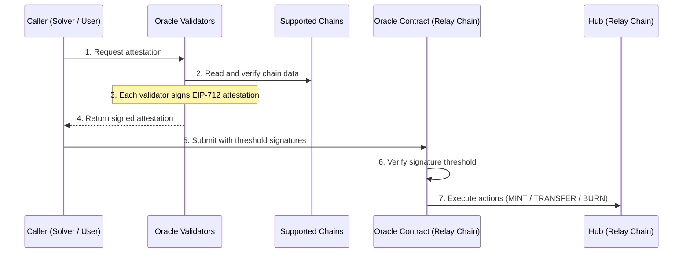

## Overview

The Oracle is a decentralized validator set that verifies crosschain activity and produces signed attestations for the [Hub](/references/protocol/components/hub) on the [Relay Chain](/references/protocol/components/relay-chain). Validators independently read origin and destination chains, verify that deposits and fills occurred correctly, and sign EIP-712 attestations. Attestations require signatures from a threshold of validators before the Hub will accept them.

The Oracle never initiates actions — it only responds to requests. Solvers and users call the Oracle when they need verification, and the Oracle returns signed attestations that the caller then submits to the Hub. This **pull-based** model keeps costs low and avoids the overhead of maintaining persistent message channels to every chain.

## What the Oracle Attests

The Oracle can attest to five types of events:

### Deposits

When requested, the Oracle verifies that a user's deposit into the [Depository](/references/protocol/components/depository) occurred on the origin chain. The resulting attestation triggers a **MINT** action on the Hub, creating a token balance that represents the deposited funds.

### Fills

When requested, the Oracle verifies that a solver's fill on the destination chain matched the user's intent (correct destination, amount, and action). The resulting attestation triggers a **TRANSFER** action on the Hub, moving the balance from the user to the solver.

### Refunds

If a solver can't fill an order, they can send funds directly to the user on the origin chain. The solver then requests an attestation from the Oracle, which verifies the refund occurred and returns a signed attestation. The solver submits this to the Hub to get reimbursed — the same settlement process as a fill.

### Withdrawals

The Oracle plays two roles in the withdrawal flow:

1. **Proof generation** — When a solver requests a withdrawal, the Oracle verifies the solver's transfer to a [withdrawal address](/references/protocol/components/hub#withdrawal-addresses) on the Hub, decodes the withdrawal parameters, and forwards the request to the [Allocator](/references/protocol/components/allocator) on Aurora for proof generation.

2. **Burn attestation** — After the solver claims funds from the Depository, the solver requests a burn attestation. The Oracle verifies the withdrawal occurred on the target chain and returns a signed attestation that the solver submits to the Hub as a **BURN** action.

## How It Works

The Oracle operates as a request-response pipeline:

1. **Request** — A solver or user calls the Oracle to request verification of a crosschain event
2. **Verify** — Each validator independently reads chain data to confirm event details
3. **Sign** — Each validator creates an EIP-712 typed data signature over the attestation
4. **Return** — The signed attestation is returned to the caller, who submits it to the Oracle contract on the Relay Chain. The contract verifies the threshold is met and executes the actions on the Hub

### Pull-Based Verification

A key cost optimization is that the Oracle does not require message-passing infrastructure (like LayerZero or Hyperlane) between chains. Instead:

- Validators read **historical chain data** on-demand when a caller requests verification
- Attestations are submitted by the caller to the Relay Chain, meaning **no gas is spent on origin or destination chains** for verification
- This dramatically reduces the per-order cost of verification compared to protocols that emit and relay crosschain messages

### Batch Execution

The Oracle supports batch attestation via `executeMultiple()`. Multiple attestations (across different orders and action types) can be submitted in a single transaction on the Relay Chain, further amortizing gas costs.

If an individual attestation in a batch has already been processed, it is skipped rather than reverting the entire batch.

## Oracle Contract

The Oracle contract on the Relay Chain is a thin verification layer. It receives batches of signed attestations, verifies that each attestation has the required number of valid signatures from registered validators, and calls the corresponding action on the Hub. The contract itself does not perform any crosschain verification — it trusts the validator set's signatures and enforces the threshold requirement.

The contract manages the validator set via role-based access control, and ensures idempotency so that the same attestation cannot be processed twice.

## Security

The Oracle is a trust-critical component — it determines which deposits and fills are considered valid. Several properties limit the impact of a compromise:

- **Consensus threshold** — Attestations require signatures from multiple independent validators, preventing any single validator from submitting false attestations
- **Cannot steal funds** — Even a compromised Oracle can only incorrectly attribute balances on the Hub. User funds in the Depository remain protected by the [Allocator's](/references/protocol/components/allocator) independent withdrawal authorization.
- **Bounded impact** — The [Security Council](/references/protocol/components/security-council) can pause the system if anomalous attestations are detected

## Source Code

The Oracle contract is part of the [`settlement-protocol`](https://github.com/relayprotocol/settlement-protocol) repository. The contract is deployed on the Relay Chain and can be viewed on the [Relay Chain Explorer](https://explorer.chain.relay.link).
