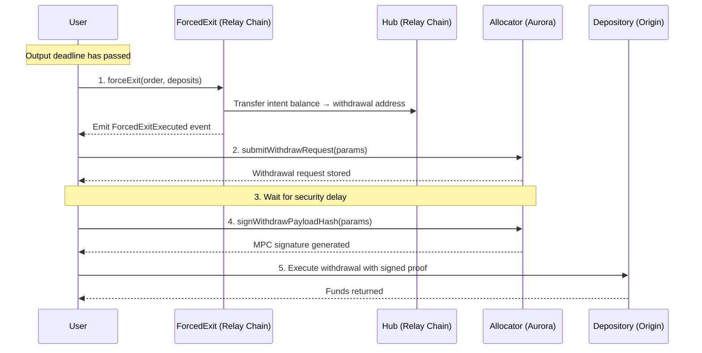

A forced exit allows a user to reclaim their deposited funds when a solver fails to fill an order **and** fails to refund.

## When to Use

A forced exit applies when:

- The order's **output deadline** has passed (the fill window expired)
- The solver did not fill the order
- The solver did not issue a refund
- The user's deposit was attested and minted on the [Hub](/references/protocol/components/hub), but the balance was never transferred to a solver

## How It Works

The forced exit flow spans the [Relay Chain](/references/protocol/components/relay-chain), Aurora (where the [Allocator](/references/protocol/components/allocator) is deployed), and the origin chain where the user's deposit sits in the [Depository](/references/protocol/components/depository).



**Step by step:**

1. **Force exit on Relay Chain** — The user calls `forceExit` on the ForcedExit contract, passing the order and deposit info. The contract verifies the output deadline has passed, computes the intent address, and transfers the intent's Hub balance to a deterministic withdrawal address. A `ForcedExitExecuted` event is emitted with the withdrawal details.

2. **Submit withdrawal request** — The user calls `submitWithdrawRequest` on the [Allocator](/references/protocol/components/allocator), passing the withdrawal parameters from the force exit event. The Allocator stores the request and starts the security delay timer.

3. **Wait for security delay** — A configurable delay must pass before the withdrawal can be signed. This gives the [Security Council](/references/protocol/components/security-council) time to intervene if something is wrong.

4. **Sign withdrawal payload** — After the delay, the user calls `signWithdrawPayloadHash` on the Allocator. This triggers the MPC signing process via the NEAR chain signatures network. The user polls for the signature.

5. **Execute on origin chain** — The user submits the MPC-signed proof to the Depository on the origin chain. The Depository verifies the signature and releases the funds.

## Manually Perform a Forced Exit

This section walks through each contract interaction. You need:

- The **order JSON** (the original order struct)
- The **deposit info** (timestamp and depositor address for each input)
- A wallet with ETH on the Relay Chain and Aurora for gas

### Step 1: Call `forceExit`

Call `ForcedExit.forceExit(order, deposits)` on the Relay Chain. Ensure the order's output deadline has passed.

```typescript
import { createWalletClient, http } from "viem";

const FORCED_EXIT_ADDRESS = "0x..."; // TODO: add production address

const tx = await walletClient.writeContract({
  address: FORCED_EXIT_ADDRESS,
  abi: forcedExitAbi,
  functionName: "forceExit",
  args: [order, deposits],
});
```

The `order` and `deposits` arguments:

```json
// order — the original Order struct
{
  "inputs": [
    {
      "chainId": 8453,                    // origin chain (e.g. Base)
      "currency": "0xA0b8...0001",        // token address
      "amount": "1000000",                // deposit amount
      "depositAddress": "0x...",          // depository deposit address
      "refunds": [
        {
          "chainId": 8453,                // chain to receive the refund
          "recipient": "0xYourAddress",   // refund recipient
          "minimumAmount": "990000"       // minimum refund amount
        }
      ]
    }
  ],
  "output": {
    "chainId": 10,                        // destination chain (e.g. Optimism)
    "currency": "0xA0b8...0001",
    "amount": "990000",
    "recipient": "0xYourAddress",
    "deadline": 1710000000                // unix timestamp — must be in the past
  }
}

// deposits — one DepositInfo per input
[
  {
    "timestamp": 1709999000,              // block timestamp of the deposit tx
    "depositor": "0xYourAddress"          // address that made the deposit
  }
]
```

On success, the contract emits a `ForcedExitExecuted` event:

```
ForcedExitExecuted(orderId, intentAddress, withdrawalAddress, tokenId, amount, withdrawalNonce)
```

Save the **`withdrawalAddress`**, **`amount`**, and **`withdrawalNonce`** from this event — you need them for the next step.

### Step 2: Submit Withdrawal Request

Call `RelayAllocator.submitWithdrawRequest(params)` on Aurora, using the values from the force exit event.

```typescript
const ALLOCATOR_ADDRESS = "0x7EdA04920F22ba6A2b9f2573fd9a6F6F1946Ff9f";

const withdrawParams = {
  chainId: order.inputs[0].refunds[0].chainId, // refund chain
  depository: depositoryAddress, // depository on the refund chain
  currency: order.inputs[0].currency,
  amount: amount, // from ForcedExitExecuted event
  spender: withdrawalAddress, // from ForcedExitExecuted event
  receiver: order.inputs[0].refunds[0].recipient, // refund recipient
  data: "0x",
  nonce: withdrawalNonce, // from ForcedExitExecuted event
};

const tx = await walletClient.writeContract({
  address: ALLOCATOR_ADDRESS,
  abi: allocatorAbi,
  functionName: "submitWithdrawRequest",
  args: [withdrawParams],
});
```

### Step 3: Wait for Security Delay

After submitting, a security delay must pass before the payload can be signed. Query the delay:

```typescript
const delay = await publicClient.readContract({
  address: ALLOCATOR_ADDRESS,
  abi: allocatorAbi,
  functionName: "getEffectiveDelay",
  args: [depositoryAddress],
});
```

Wait for `delay` seconds to pass from the time of the `submitWithdrawRequest` transaction.

### Step 4: Sign the Withdrawal Payload

After the delay, trigger MPC signing:

```typescript
const tx = await walletClient.writeContract({
  address: ALLOCATOR_ADDRESS,
  abi: allocatorAbi,
  functionName: "signWithdrawPayloadHash",
  args: [withdrawParams, signature, gasSettings, hashIndex],
});
```

The MPC signing is asynchronous. Poll for the signed payload:

```typescript
let signedPayload = null;
for (let i = 0; i < 60; i++) {
  signedPayload = await publicClient.readContract({
    address: ALLOCATOR_ADDRESS,
    abi: allocatorAbi,
    functionName: "signedPayloads",
    args: [withdrawRequestHash, hashToSign],
  });

  if (signedPayload) break;
  await new Promise((r) => setTimeout(r, 2000)); // poll every 2s
}
```

### Step 5: Execute on Origin Chain

Submit the MPC-signed proof to the Depository on the origin chain:

```typescript
const tx = await originWalletClient.writeContract({
  address: depositoryAddress,
  abi: depositoryAbi,
  functionName: "execute",
  args: [signedWithdrawalPayload],
});
```

Once confirmed, the funds are released to the refund recipient specified in the order.

### Full Script

```typescript expandable
import {
  createPublicClient,
  createWalletClient,
  http,
  parseAbiItem,
} from "viem";
import { privateKeyToAccount } from "viem/accounts";

// --- Configuration ---
const FORCED_EXIT_ADDRESS = "0x..."; // TODO: add production address
const ALLOCATOR_ADDRESS = "0x7EdA04920F22ba6A2b9f2573fd9a6F6F1946Ff9f";

const account = privateKeyToAccount("0xYOUR_PRIVATE_KEY");

// Relay Chain client (for forceExit)
const relayChainClient = createPublicClient({
  chain: { id: 537713, name: "Relay Chain", nativeCurrency: { name: "ETH", symbol: "ETH", decimals: 18 }, rpcUrls: { default: { http: ["https://rpc.chain.relay.link"] } } },
  transport: http(),
});
const relayChainWallet = createWalletClient({
  account,
  chain: relayChainClient.chain,
  transport: http(),
});

// Aurora client (for Allocator interactions)
const auroraClient = createPublicClient({
  chain: { id: 1313161554, name: "Aurora", nativeCurrency: { name: "ETH", symbol: "ETH", decimals: 18 }, rpcUrls: { default: { http: ["https://mainnet.aurora.dev"] } } },
  transport: http(),
});
const auroraWallet = createWalletClient({
  account,
  chain: auroraClient.chain,
  transport: http(),
});

// Origin chain client (for Depository execution) — configure for your origin chain
const originClient = createPublicClient({ /* ... */ });
const originWallet = createWalletClient({ /* ... */ });

// --- Inputs ---
const order = { /* your order struct */ };
const deposits = [{ /* your deposit info */ }];
const depositoryAddress = "0x..."; // depository on the origin chain

// --- Step 1: Force Exit (Relay Chain) ---
console.log("Step 1: Calling forceExit...");
const forceExitTx = await relayChainWallet.writeContract({
  address: FORCED_EXIT_ADDRESS,
  abi: forcedExitAbi,
  functionName: "forceExit",
  args: [order, deposits],
});
const forceExitReceipt = await relayChainClient.waitForTransactionReceipt({
  hash: forceExitTx,
});

// Parse ForcedExitExecuted event
const forcedExitEvent = parseAbiItem(
  "event ForcedExitExecuted(bytes32 orderId, address intentAddress, address withdrawalAddress, uint256 tokenId, uint256 amount, uint256 withdrawalNonce)"
);
const logs = forceExitReceipt.logs.filter(
  (log) => log.address.toLowerCase() === FORCED_EXIT_ADDRESS.toLowerCase()
);
const { withdrawalAddress, amount, withdrawalNonce } = decodeEventLog({
  abi: [forcedExitEvent],
  data: logs[0].data,
  topics: logs[0].topics,
}).args;

console.log("Force exit complete:", { withdrawalAddress, amount, withdrawalNonce });

// --- Step 2: Submit Withdrawal Request (Aurora) ---
console.log("Step 2: Submitting withdrawal request...");
const withdrawParams = {
  chainId: order.inputs[0].refunds[0].chainId,
  depository: depositoryAddress,
  currency: order.inputs[0].currency,
  amount: amount,
  spender: withdrawalAddress,
  receiver: order.inputs[0].refunds[0].recipient,
  data: "0x",
  nonce: withdrawalNonce,
};

const submitTx = await auroraWallet.writeContract({
  address: ALLOCATOR_ADDRESS,
  abi: allocatorAbi,
  functionName: "submitWithdrawRequest",
  args: [withdrawParams],
});
await auroraClient.waitForTransactionReceipt({ hash: submitTx });

// --- Step 3: Wait for Security Delay ---
console.log("Step 3: Waiting for security delay...");
const delay = await auroraClient.readContract({
  address: ALLOCATOR_ADDRESS,
  abi: allocatorAbi,
  functionName: "getEffectiveDelay",
  args: [depositoryAddress],
});
console.log(`Security delay: ${delay} seconds`);
await new Promise((r) => setTimeout(r, Number(delay) * 1000));

// --- Step 4: Sign Withdrawal Payload (Aurora) ---
console.log("Step 4: Requesting MPC signature...");
const signTx = await auroraWallet.writeContract({
  address: ALLOCATOR_ADDRESS,
  abi: allocatorAbi,
  functionName: "signWithdrawPayloadHash",
  args: [withdrawParams, signature, gasSettings, hashIndex],
});
await auroraClient.waitForTransactionReceipt({ hash: signTx });

// Poll for the signed payload
console.log("Polling for MPC signature...");
let signedPayload = null;
for (let i = 0; i < 60; i++) {
  signedPayload = await auroraClient.readContract({
    address: ALLOCATOR_ADDRESS,
    abi: allocatorAbi,
    functionName: "signedPayloads",
    args: [withdrawRequestHash, hashToSign],
  });
  if (signedPayload) break;
  await new Promise((r) => setTimeout(r, 2000));
}

if (!signedPayload) {
  throw new Error("MPC signature not received after 2 minutes");
}
console.log("MPC signature received");

// --- Step 5: Execute on Origin Chain ---
console.log("Step 5: Executing withdrawal on origin chain...");
const executeTx = await originWallet.writeContract({
  address: depositoryAddress,
  abi: depositoryAbi,
  functionName: "execute",
  args: [signedPayload],
});
const executeReceipt = await originClient.waitForTransactionReceipt({
  hash: executeTx,
});

console.log("Forced exit complete! Funds returned.", executeReceipt.transactionHash);
```

## Using the Forced Exit UI

<Info>
An open-source forced exit frontend is in development. Documentation will be added here once available.
</Info>

## Costs

- **Gas on Relay Chain and Aurora** — Step 1 is on the Relay Chain, steps 2-4 are on Aurora. Gas costs on both are minimal.
- **Gas on origin chain** — Step 5 requires a transaction on the origin chain to execute the withdrawal.
- **No protocol fees** — Forced exits do not incur additional protocol fees beyond gas costs.

## Common Errors

| Error | Cause |
|-------|-------|
| `DeadlineNotPassed(deadline, currentTime)` | The order's output deadline hasn't expired yet. Wait until `block.timestamp > order.output.deadline`. |
| `NoBalanceToExit(intentAddress, tokenId)` | The intent address has zero balance on the Hub. The deposit may not have been attested, or a solver already claimed it. |
| `NoRefundConfigured(inputIndex)` | The order input at this index has no refund configuration. |
| `ChainNotConfigured(chainId)` | The target chain is not registered in the ForcedExit contract. |

