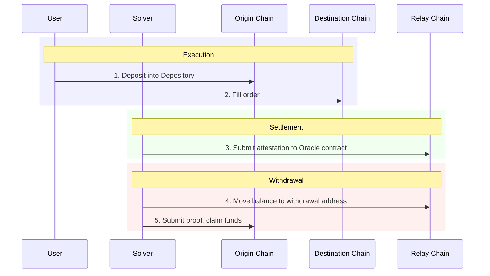
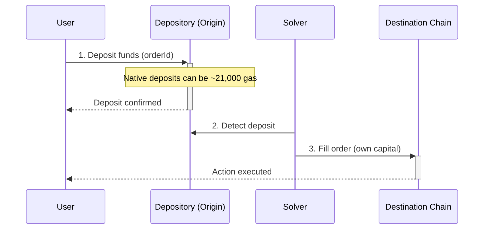
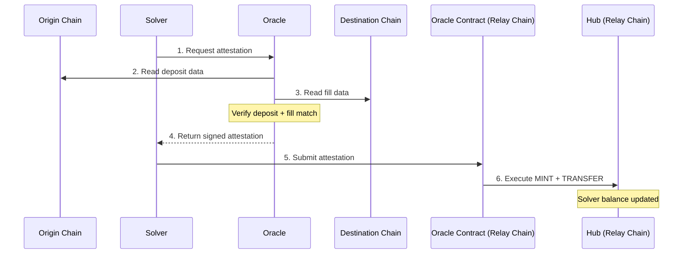
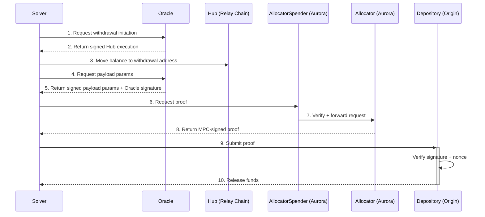
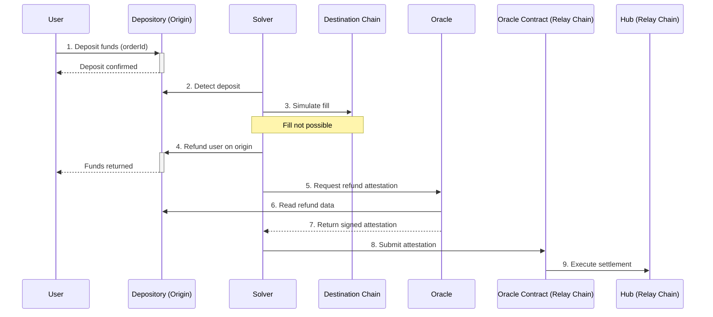

Relay is a crosschain intents protocol. Users express what they want (e.g., bridge 1 ETH from Optimism to Base), and third-party solvers fill those orders using their own capital. The protocol then settles solvers — verifying fills and reimbursing them from the user's escrowed deposit.

What makes Relay different is how settlement works. It's designed from the ground up for maximum efficiency & compatibility:
- A dedicated low-cost settlement chain ([Relay Chain](/references/protocol/components/relay-chain))
- A custom [Oracle](/references/protocol/components/oracle) that can _read_ data from any chain / VM
- Programmable MPC signatures to _write_ back to any chain / VM 

## Contracts

The protocol is coordinated through 3 main smart contracts:

| Contract | Role | Location |
|-----------|------|----------|
| [**Depository**](/references/protocol/components/depository) | Holds user deposits on each origin chain | Every supported chain (80+) |
| [**Hub**](/references/protocol/components/hub) | Tracks token ownership and solver balances | Relay Chain |
| [**Allocator**](/references/protocol/components/allocator) | Generates MPC withdrawal payloads | Aurora (NEAR) |

## Flows

Every crosschain order in Relay passes through three sequential flows: **Execution**, **Settlement**, and **Withdrawal**. 

### 1. Execution Flow

Execution is the user-facing part of the process. The user deposits funds on the origin chain, and a solver fills their order on the destination chain.

**Step by step:**

1. **User requests a quote** — The user specifies what they want (e.g., bridge 1 ETH from Optimism to Base). The Relay API returns quotes from available solvers.

2. **User deposits into Depository** — The user sends funds to the [Depository](/references/protocol/components/depository) contract on the origin chain. The deposit is tagged with an **orderId** that links it to the solver's commitment. This costs approximately 21,000 gas — close to a simple transfer.

3. **Solver fills on destination** — The solver detects the deposit and executes the user's requested action on the destination chain using their own capital. The fill can be a simple transfer, a swap, or any arbitrary onchain action.

<Tip>
Because deposits go to the Depository (not to the solver directly), user funds are protected. If the solver fails to fill, the user can reclaim their deposit.
</Tip>

### 2. Settlement Flow

Settlement is the process of verifying that the solver correctly filled the order, and crediting them on the Hub.

**Step by step:**

1. **Solver requests attestation** — After filling an order, the solver calls the [Oracle](/references/protocol/components/oracle) to request settlement.

2. **Oracle reads origin chain** — The Oracle reads the origin chain to verify that the user's deposit occurred and matches the expected order.

3. **Oracle reads destination chain** — The Oracle reads the destination chain to verify that the solver's fill matches the user's intent (correct destination, amount, and action).

4. **Oracle returns attestation** — Oracle validators each verify the data and sign an EIP-712 attestation. Once a threshold of signatures is collected, the signed attestation is returned to the solver.

5. **Solver submits to Oracle contract** — The solver submits the signed attestation to the Oracle contract on the [Relay Chain](/references/protocol/components/relay-chain), which verifies the authorized signer and executes on the [Hub](/references/protocol/components/hub). This triggers two actions:
   - **MINT** — The user's deposit is represented as a token balance on the Hub
   - **TRANSFER** — That balance is transferred from the user to the solver

<Info>
Settlement happens in real-time, per-order. There is no batching window. As soon as the Oracle verifies a fill, the solver's balance is updated on the Hub.
</Info>

### 3. Withdrawal Flow

Withdrawal is how solvers extract funds from the Depository to replenish their capital. Solvers accumulate balances on the Hub and can withdraw from any origin chain at any time.

**Step by step:**

1. **Solver requests withdrawal initiation** — The solver asks the [Oracle](/references/protocol/components/oracle) to initiate a withdrawal, providing the target chain, depository, currency, amount, recipient, and nonce.

2. **Oracle returns Hub execution** — The Oracle computes the deterministic **withdrawal address** for those parameters and returns a signed Hub execution that moves the requested balance to that address.

3. **Solver moves balance on Hub** — The solver submits that execution on the [Relay Chain](/references/protocol/components/relay-chain), so the withdrawal address now holds the requested Hub balance.

4. **Solver requests payload params** — The solver calls the [Oracle](/references/protocol/components/oracle) again to request the signed payload parameters for the withdrawal.

5. **Oracle returns payload params** — The Oracle verifies that the withdrawal address holds the requested balance and returns the payload parameters together with an Oracle signature for the next step.

6. **Solver submits to `RelayAllocatorSpender`** — The solver submits those payload parameters and the Oracle signature to `RelayAllocatorSpender`, which verifies the Oracle authorization and forwards the request to the [Allocator](/references/protocol/components/allocator).

7. **Allocator builds and signs** — The [Allocator](/references/protocol/components/allocator) constructs the chain-specific payload and generates an MPC-signed cryptographic proof (EIP-712 for EVM, Ed25519 for Solana).

8. **Proof is returned to solver** — The signed proof is returned to the solver.

9. **Solver submits proof** — The solver submits the signed proof to the [Depository](/references/protocol/components/depository) contract on the target chain.

10. **Depository releases funds** — The Depository verifies the signature, confirms the nonce hasn't been used, and transfers the funds to the solver.

<Tip>
Solvers choose their own withdrawal strategy. They can withdraw frequently to maximize capital velocity, or batch withdrawals to minimize transaction costs. The Hub balance accrues in real-time regardless.
</Tip>

## Refunds

Inevitably, some orders cannot be filled, and the user needs to be refunded. Relay is designed to make this experience as smooth as possible, with multiple supported pathways, depending on the circumstances:

### Fast Refund

If a solver can't fill an order on the destination, they can instantly refund the user on the origin chain. The refund mirrors the execution flow — the solver detects the deposit and acts — but instead of filling on the destination, they return funds to the user on the origin. The refund is then settled like any other fill.

**Step by step:**

1. **User deposits into Depository** — The user deposits funds into the [Depository](/references/protocol/components/depository) on the origin chain, tagged with an **orderId**.

2. **Solver detects deposit** — The solver detects the deposit and evaluates whether it can fill the order.

3. **Solver simulates fill** — The solver simulates the fill on the destination chain and determines it can't be completed (e.g., insufficient liquidity, contract error).

4. **Solver refunds on origin** — Instead of filling, the solver sends funds directly to the user on the origin chain, returning them immediately.

5. **Solver requests attestation** — The solver calls the [Oracle](/references/protocol/components/oracle) to request a refund attestation.

6. **Oracle reads origin chain** — The Oracle reads the origin chain to verify the refund occurred and matched the order's requirements.

7. **Oracle returns attestation** — Validators sign and return the attestation to the solver.

8. **Solver submits to Oracle contract** — The solver submits the attestation to the Oracle contract, which executes the settlement on the [Hub](/references/protocol/components/hub) — the same settlement process as a fill.

<Tip>
Fast refunds are the quickest way to return user funds. Because the solver acts immediately on the origin chain, the user doesn't need to wait for any expiry window.
</Tip>

Additional refund and recovery UX may exist at the product layer, but only the solver-driven refund attestation flow above is directly evidenced by the protocol code in `relay-settlement` and `relay-protocol-oracle`.
