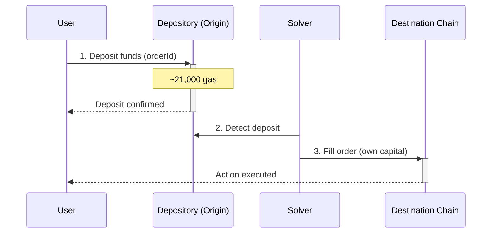
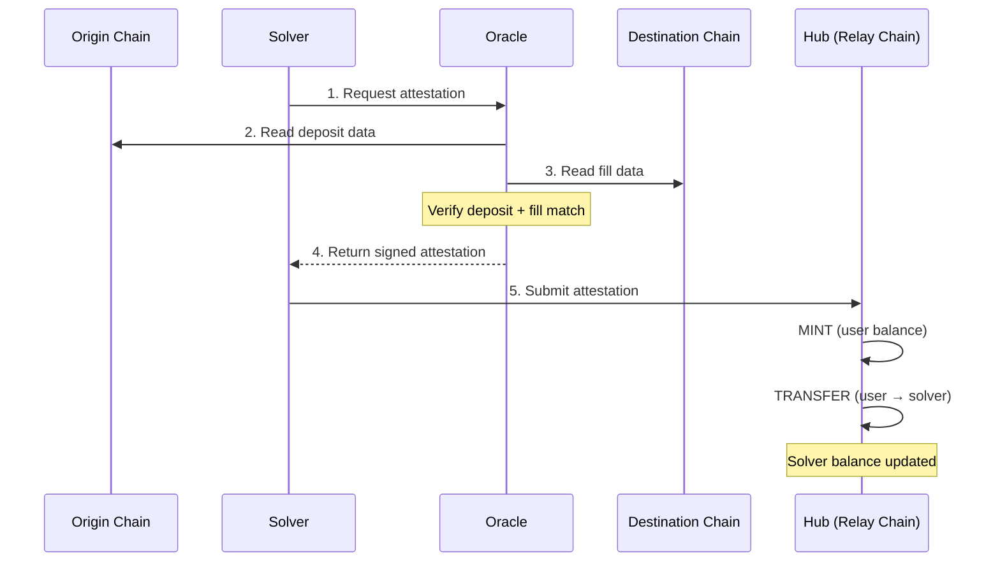
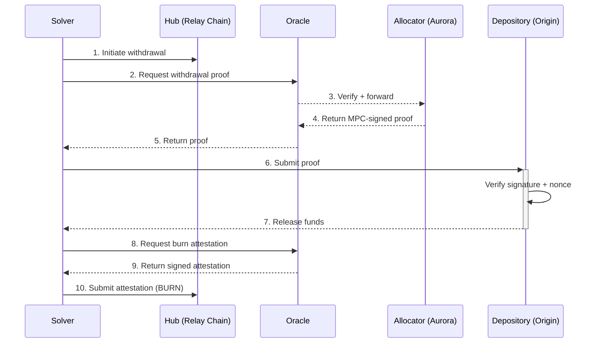
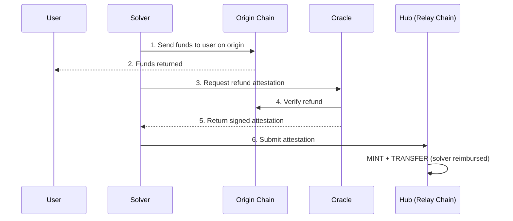
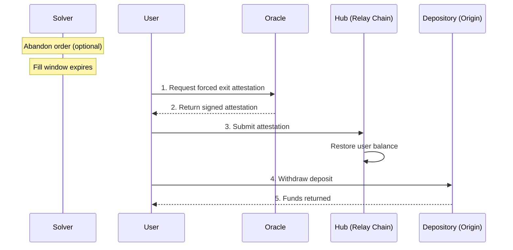

## Architecture

The protocol consists of four core components:

| Component | Role | Location |
|-----------|------|----------|
| [**Depository**](/references/protocol/components/depository) | Holds user deposits on each origin chain | Every supported chain (80+) |
| [**Oracle**](/references/protocol/components/oracle) | Verifies deposits and fills, attests to the Hub | Validator set + Relay Chain contract |
| [**Hub**](/references/protocol/components/hub) | Tracks token ownership and solver balances | Relay Chain |
| [**Allocator**](/references/protocol/components/allocator) | Generates withdrawal proofs for solvers | Aurora / MPC |

These components are supported by the [Relay Chain](/references/protocol/components/relay-chain), a purpose-built settlement chain where the Hub and Allocator contracts live and all settlement operations are processed. The [Security Council](/references/protocol/components/security-council) governs the Allocator with the ability to pause, unpause, or replace it in an emergency.

## Flows

Every crosschain order in Relay passes through three sequential flows: **Execution**, **Settlement**, and **Withdrawal**. If the solver can't fill, a **Refund** or **Forced Exit** flow returns funds to the user.

### Execution Flow

Execution is the user-facing part of the process. The user deposits funds on the origin chain, and a solver fills their order on the destination chain.

**Step by step:**

1. **User requests a quote** — The user specifies what they want (e.g., bridge 1 ETH from Optimism to Base). The Relay API returns quotes from available solvers.

2. **User deposits into Depository** — The user sends funds to the [Depository](/references/protocol/components/depository) contract on the origin chain. The deposit is tagged with an **orderId** that links it to the solver's commitment. This costs approximately 21,000 gas — close to a simple transfer.

3. **Solver fills on destination** — The solver detects the deposit and executes the user's requested action on the destination chain using their own capital. The fill can be a simple transfer, a swap, or any arbitrary onchain action.

<Tip>
Because deposits go to the Depository (not to the solver directly), user funds are protected. If the solver fails to fill, the user can reclaim their deposit.
</Tip>

### Settlement Flow

Settlement is the process of verifying that the solver correctly filled the order, and crediting them on the Hub.

**Step by step:**

1. **Solver requests attestation** — After filling an order, the solver calls the [Oracle](/references/protocol/components/oracle) to request settlement.

2. **Oracle reads origin chain** — The Oracle reads the origin chain to verify that the user's deposit occurred and matches the expected order.

3. **Oracle reads destination chain** — The Oracle reads the destination chain to verify that the solver's fill matches the user's intent (correct destination, amount, and action).

4. **Oracle returns attestation** — Oracle validators each verify the data and sign an EIP-712 attestation. Once a threshold of signatures is collected, the signed attestation is returned to the solver.

5. **Solver submits to Hub** — The solver submits the signed attestations to the Oracle contract on the [Relay Chain](/references/protocol/components/relay-chain), which verifies the threshold and executes on the [Hub](/references/protocol/components/hub). This triggers two actions:
   - **MINT** — The user's deposit is represented as a token balance on the Hub
   - **TRANSFER** — That balance is transferred from the user to the solver

<Info>
Settlement happens in real-time, per-order. There is no batching window. As soon as the Oracle verifies a fill, the solver's balance is updated on the Hub.
</Info>

### Withdrawal Flow

Withdrawal is how solvers extract funds from the Depository to replenish their capital. Solvers accumulate balances on the Hub and can withdraw from any origin chain at any time.

**Step by step:**

1. **Solver initiates withdrawal** — The solver transfers their Hub balance to a deterministic **withdrawal address** — a virtual address derived from the withdrawal parameters (target chain, depository, currency, recipient, nonce). This transfer on the Hub signals the intent to withdraw.

2. **Solver requests withdrawal proof** — The solver calls the [Oracle](/references/protocol/components/oracle) to request a withdrawal proof. The Oracle reads the Hub, verifies the transfer to the withdrawal address, and decodes the withdrawal parameters.

3. **Oracle verifies and forwards** — The Oracle verifies the withdrawal request and forwards it to the [Allocator](/references/protocol/components/allocator) on Aurora, which constructs a chain-specific payload via the appropriate Payload Builder.

4. **Allocator generates proof** — The [Allocator](/references/protocol/components/allocator) generates an MPC-signed cryptographic proof (EIP-712 for EVM, Ed25519 for Solana) that authorizes the withdrawal.

5. **Proof returned to solver** — The signed proof is returned to the solver via the Oracle.

6. **Solver submits proof** — The solver submits the signed proof to the [Depository](/references/protocol/components/depository) contract on the target chain.

7. **Depository releases funds** — The Depository verifies the signature, confirms the nonce hasn't been used, and transfers the funds to the solver.

8. **Solver requests burn attestation** — The solver calls the Oracle to attest the completed withdrawal.

8. **Oracle returns attestation** — The Oracle verifies the withdrawal occurred on the target chain and returns a signed attestation.

9. **Hub balance burned** — The solver submits the attestation to the Hub as a **BURN** action, keeping the ledger in sync.

<Tip>
Solvers choose their own withdrawal strategy. They can withdraw frequently to maximize capital velocity, or batch withdrawals to minimize transaction costs. The Hub balance accrues in real-time regardless.
</Tip>

### Refund Flow

If a solver can't fill an order on the destination, they can instantly refund the user on the origin chain. This is a variation of the execution flow — instead of filling on the destination, the solver sends funds directly to the user on the origin. The refund is then settled like a fill, and the solver gets reimbursed on the Hub.

**Step by step:**

1. **Solver refunds on origin** — The solver sends funds directly to the user on the origin chain, returning them immediately.

2. **User receives funds** — The user gets their deposit back on the origin chain without waiting for any expiry window.

3. **Solver requests attestation** — The solver calls the [Oracle](/references/protocol/components/oracle) to request a refund attestation.

4. **Oracle verifies refund** — The Oracle reads the origin chain to verify the refund occurred and matched the order's requirements.

5. **Oracle returns attestation** — Validators sign and return the attestation to the solver.

6. **Solver submits to Hub** — The solver submits the attestation to the [Hub](/references/protocol/components/hub), which mints and transfers the balance to the solver — the same settlement process as a fill.

<Tip>
Refunds are the fastest way to return user funds. Because the solver acts immediately on the origin chain, the user doesn't need to wait for any expiry window.
</Tip>

### Forced Exit Flow

If a solver fails to fill **and** doesn't refund, the user's funds are still protected. After the order's fill window expires, the user can trigger a forced exit to reclaim their deposit. Solvers can also **abandon** an order early, which shortens the expiry window and allows the forced exit to happen faster.

**Step by step:**

1. **User requests forced exit** — After the fill window expires (or after the solver abandons), the user calls the [Oracle](/references/protocol/components/oracle) to request a forced exit attestation. If the solver knows they can't fill, they can **abandon** the order early — this signals intent to not fill and shortens the expiry window so the user gets their funds back faster.

2. **Oracle returns attestation** — The Oracle verifies that the fill did not occur and returns a signed attestation to the user.

3. **User submits to Hub** — The user submits the attestation to the [Hub](/references/protocol/components/hub), which restores their token balance.

4. **User withdraws** — The user (or the protocol on their behalf) triggers a withdrawal from the [Depository](/references/protocol/components/depository) to reclaim their funds.
