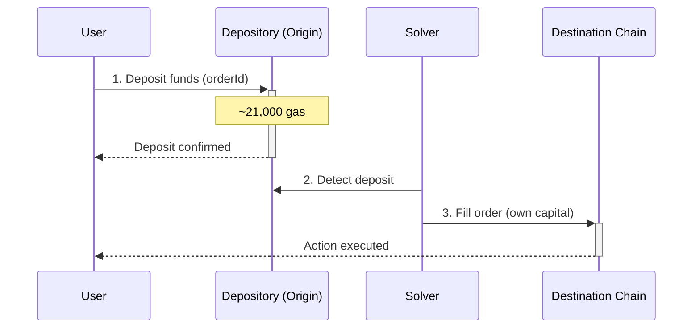
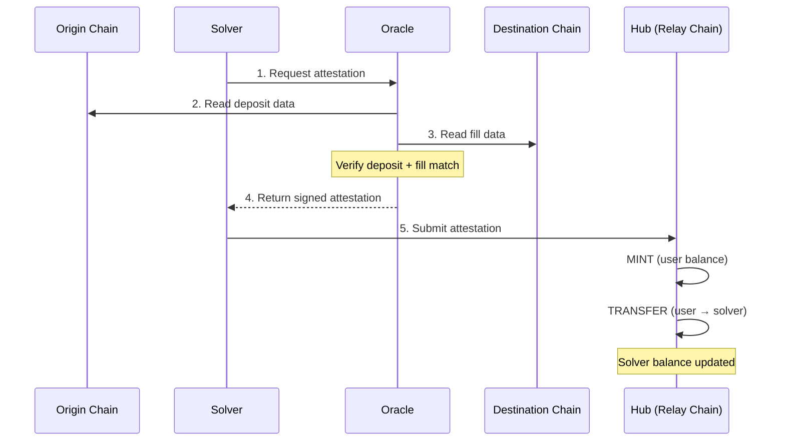
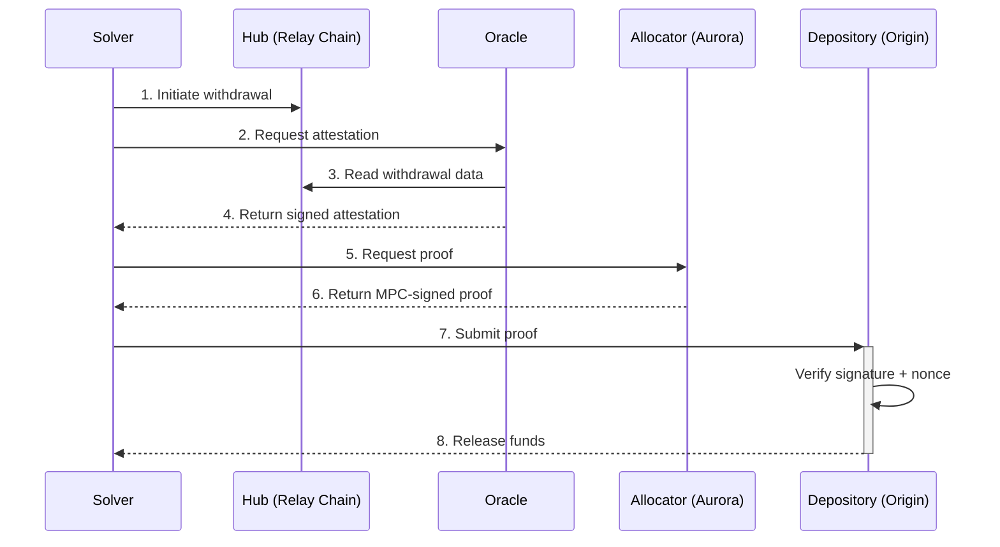
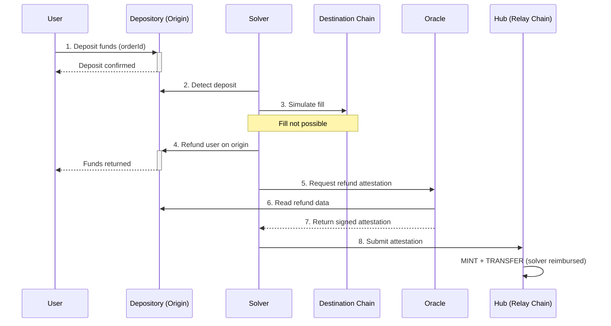
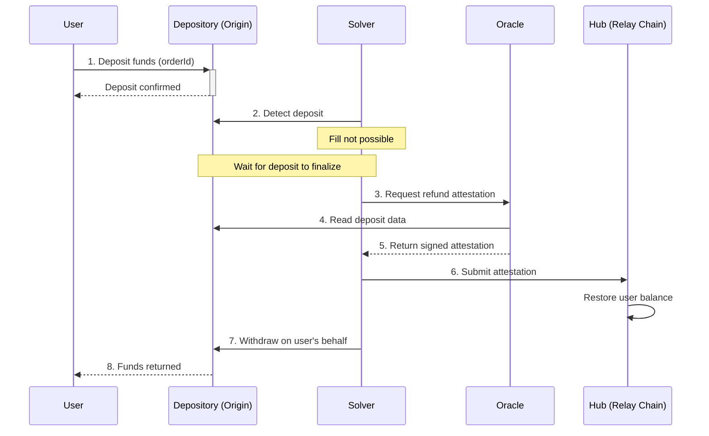
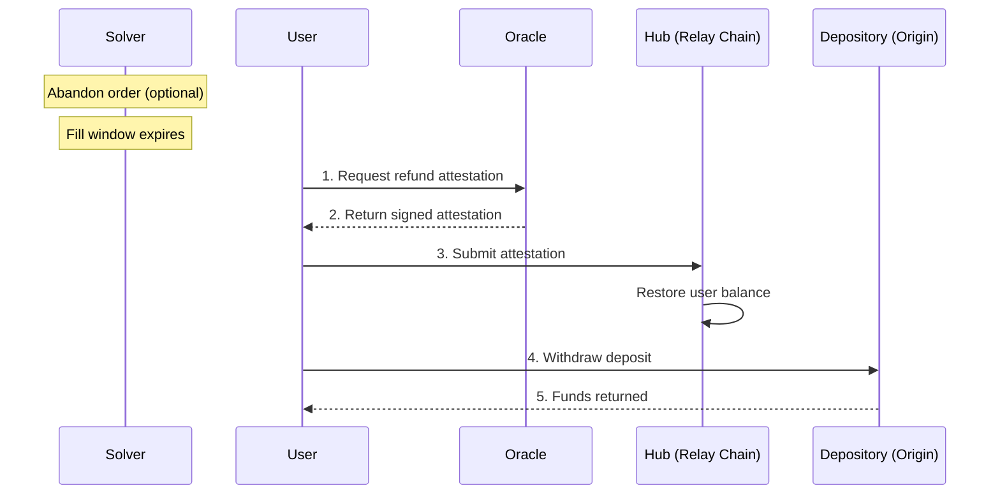

Relay is a crosschain intents protocol. Users express what they want (e.g., bridge 1 ETH from Optimism to Base), and third-party solvers fill those orders using their own capital. The protocol then settles solvers — verifying fills and reimbursing them from the user's escrowed deposit.

What makes Relay different is how settlement works. It's designed from the ground up for maximum efficiency & compatibility:
- A dedicated low-cost settlement chain ([Relay Chain](/references/protocol/components/relay-chain))
- A custom [Oracle](/references/protocol/components/oracle) that can _read_ data from any chain / VM
- Programmable MPC signatures to _write_ back to any chain / VM 

## Contracts

The protocol is coordinated through 3 main smart contracts:

| Contract | Role | Location |
|-----------|------|----------|
| [**Depository**](/references/protocol/components/depository) | Holds user deposits on each origin chain | Every supported chain (80+) |
| [**Hub**](/references/protocol/components/hub) | Tracks token ownership and solver balances | Relay Chain |
| [**Allocator**](/references/protocol/components/allocator) | Generates MPC withdrawal payloads | Aurora (NEAR) |

## Flows

Every crosschain order in Relay passes through three sequential flows: **Execution**, **Settlement**, and **Withdrawal**. 

### 1. Execution Flow

Execution is the user-facing part of the process. The user deposits funds on the origin chain, and a solver fills their order on the destination chain.

**Step by step:**

1. **User requests a quote** — The user specifies what they want (e.g., bridge 1 ETH from Optimism to Base). The Relay API returns quotes from available solvers.

2. **User deposits into Depository** — The user sends funds to the [Depository](/references/protocol/components/depository) contract on the origin chain. The deposit is tagged with an **orderId** that links it to the solver's commitment. This costs approximately 21,000 gas — close to a simple transfer.

3. **Solver fills on destination** — The solver detects the deposit and executes the user's requested action on the destination chain using their own capital. The fill can be a simple transfer, a swap, or any arbitrary onchain action.

<Tip>
Because deposits go to the Depository (not to the solver directly), user funds are protected. If the solver fails to fill, the user can reclaim their deposit.
</Tip>

### 2. Settlement Flow

Settlement is the process of verifying that the solver correctly filled the order, and crediting them on the Hub.

**Step by step:**

1. **Solver requests attestation** — After filling an order, the solver calls the [Oracle](/references/protocol/components/oracle) to request settlement.

2. **Oracle reads origin chain** — The Oracle reads the origin chain to verify that the user's deposit occurred and matches the expected order.

3. **Oracle reads destination chain** — The Oracle reads the destination chain to verify that the solver's fill matches the user's intent (correct destination, amount, and action).

4. **Oracle returns attestation** — Oracle validators each verify the data and sign an EIP-712 attestation. Once a threshold of signatures is collected, the signed attestation is returned to the solver.

5. **Solver submits to Hub** — The solver submits the signed attestations to the Oracle contract on the [Relay Chain](/references/protocol/components/relay-chain), which verifies the threshold and executes on the [Hub](/references/protocol/components/hub). This triggers two actions:
   - **MINT** — The user's deposit is represented as a token balance on the Hub
   - **TRANSFER** — That balance is transferred from the user to the solver

<Info>
Settlement happens in real-time, per-order. There is no batching window. As soon as the Oracle verifies a fill, the solver's balance is updated on the Hub.
</Info>

### 3. Withdrawal Flow

Withdrawal is how solvers extract funds from the Depository to replenish their capital. Solvers accumulate balances on the Hub and can withdraw from any origin chain at any time.

**Step by step:**

1. **Solver initiates withdrawal** — The solver transfers their Hub balance to a deterministic **withdrawal address** — a virtual address derived from the withdrawal parameters (target chain, depository, currency, recipient, nonce). This transfer on the Hub signals the intent to withdraw.

2. **Solver requests attestation** — The solver calls the [Oracle](/references/protocol/components/oracle) to request a withdrawal attestation.

3. **Oracle reads Hub** — The Oracle reads the Hub to verify the transfer to the withdrawal address and decodes the withdrawal parameters.

4. **Oracle returns attestation** — Oracle validators each verify the data and return a signed attestation to the solver.

5. **Solver requests proof** — The solver calls the [Allocator](/references/protocol/components/allocator) with the attestation to request a withdrawal proof. The Allocator constructs a chain-specific payload via the appropriate Payload Builder.

6. **Allocator returns proof** — The [Allocator](/references/protocol/components/allocator) generates an MPC-signed cryptographic proof (EIP-712 for EVM, Ed25519 for Solana) that authorizes the withdrawal, and returns it to the solver.

7. **Solver submits proof** — The solver submits the signed proof to the [Depository](/references/protocol/components/depository) contract on the target chain.

8. **Depository releases funds** — The Depository verifies the signature, confirms the nonce hasn't been used, and transfers the funds to the solver.

<Tip>
Solvers choose their own withdrawal strategy. They can withdraw frequently to maximize capital velocity, or batch withdrawals to minimize transaction costs. The Hub balance accrues in real-time regardless.
</Tip>

## Refunds

Inevitably, some orders cannot be filled, and the user needs to be refunded. Relay is designed to make this experience as smooth as possible, with multiple supported pathways, depending on the circumstances:

### Fast Refund

If a solver can't fill an order on the destination, they can instantly refund the user on the origin chain. The refund mirrors the execution flow — the solver detects the deposit and acts — but instead of filling on the destination, they return funds to the user on the origin. The refund is then settled like any other fill.

**Step by step:**

1. **User deposits into Depository** — The user deposits funds into the [Depository](/references/protocol/components/depository) on the origin chain, tagged with an **orderId**.

2. **Solver detects deposit** — The solver detects the deposit and evaluates whether it can fill the order.

3. **Solver simulates fill** — The solver simulates the fill on the destination chain and determines it can't be completed (e.g., insufficient liquidity, contract error).

4. **Solver refunds on origin** — Instead of filling, the solver sends funds directly to the user on the origin chain, returning them immediately.

5. **Solver requests attestation** — The solver calls the [Oracle](/references/protocol/components/oracle) to request a refund attestation.

6. **Oracle reads origin chain** — The Oracle reads the origin chain to verify the refund occurred and matched the order's requirements.

7. **Oracle returns attestation** — Validators sign and return the attestation to the solver.

8. **Solver submits to Hub** — The solver submits the attestation to the [Hub](/references/protocol/components/hub), which mints and transfers the balance to the solver — the same settlement process as a fill.

<Tip>
Fast refunds are the quickest way to return user funds. Because the solver acts immediately on the origin chain, the user doesn't need to wait for any expiry window.
</Tip>

### Slow Refund

If a solver can't fill but the deposit hasn't finalized yet on the origin chain, the solver waits for finalization before triggering the refund on the user's behalf. This is slower than a fast refund but still doesn't require user action.

**Step by step:**

1. **User deposits into Depository** — The user deposits funds into the [Depository](/references/protocol/components/depository) on the origin chain, tagged with an **orderId**.

2. **Solver detects deposit** — The solver detects the deposit and determines it can't fill the order.

3. **Solver requests refund attestation** — After the deposit finalizes on the origin chain, the solver calls the [Oracle](/references/protocol/components/oracle) to request a refund attestation.

4. **Oracle reads origin chain** — The Oracle reads the origin chain to verify the deposit and confirm the order was not filled.

5. **Oracle returns attestation** — Validators sign and return the attestation to the solver.

6. **Solver submits to Hub** — The solver submits the attestation to the [Hub](/references/protocol/components/hub), which restores the user's balance.

7. **Solver withdraws on user's behalf** — The solver triggers a withdrawal from the [Depository](/references/protocol/components/depository), returning the user's original deposit.

8. **User receives funds** — The funds are returned to the user on the origin chain.

<Info>
Slow refunds require the solver to wait for the deposit to finalize on the origin chain before initiating the refund. This adds latency but the user doesn't need to take any action.
</Info>

### Self Refund

If a solver fails to fill **and** doesn't refund, the user's funds are still protected. After the order's fill window expires, the user can trigger a self refund to reclaim their deposit. Solvers can also **abandon** an order early, which shortens the expiry window and allows the self refund to happen faster.

**Step by step:**

1. **User requests refund** — After the fill window expires (or after the solver abandons), the user calls the [Oracle](/references/protocol/components/oracle) to request a refund attestation. If the solver knows they can't fill, they can **abandon** the order early — this signals intent to not fill and shortens the expiry window so the user gets their funds back faster.

2. **Oracle returns attestation** — The Oracle verifies that the fill did not occur and returns a signed attestation to the user.

3. **User submits to Hub** — The user submits the attestation to the [Hub](/references/protocol/components/hub), which restores their token balance.

4. **User withdraws** — The user (or the protocol on their behalf) triggers a withdrawal from the [Depository](/references/protocol/components/depository) to reclaim their funds.
