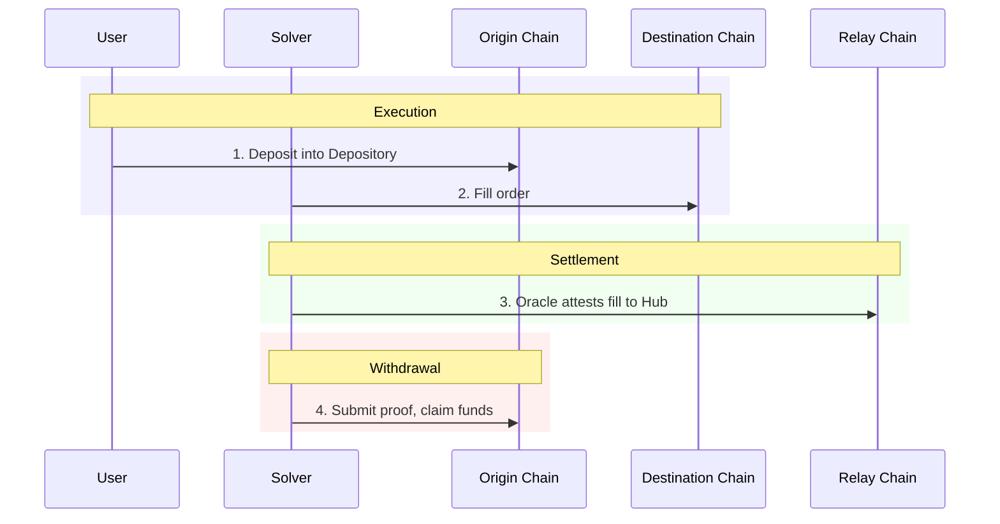
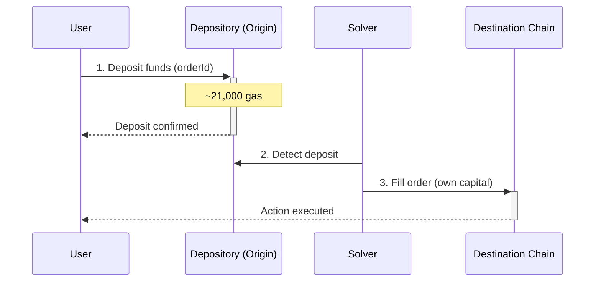
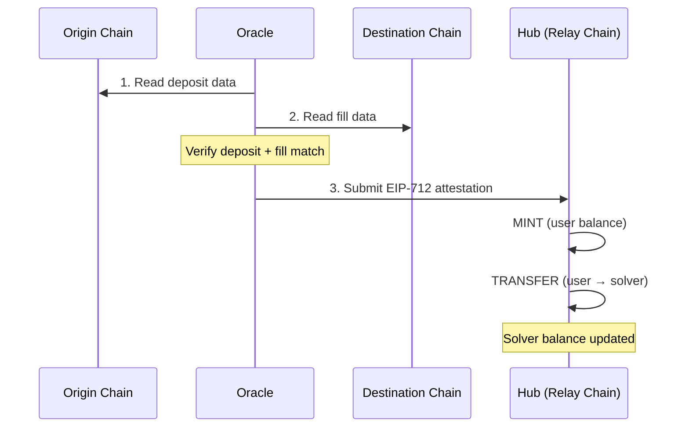
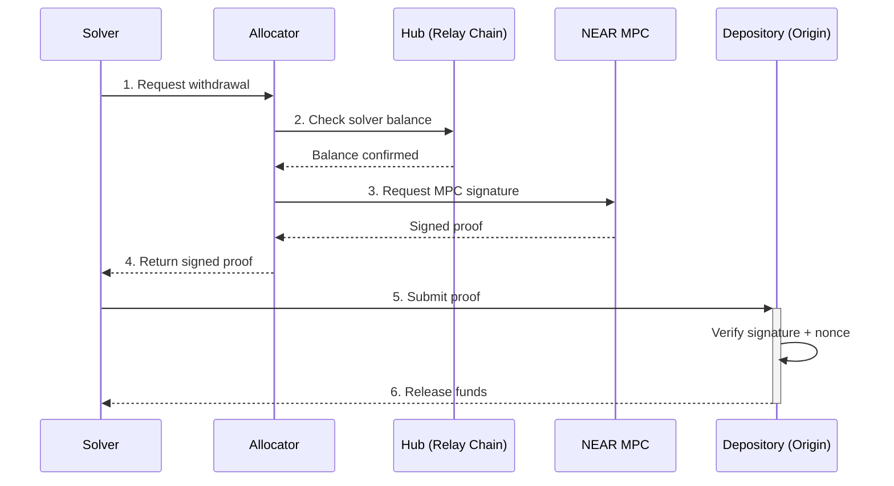
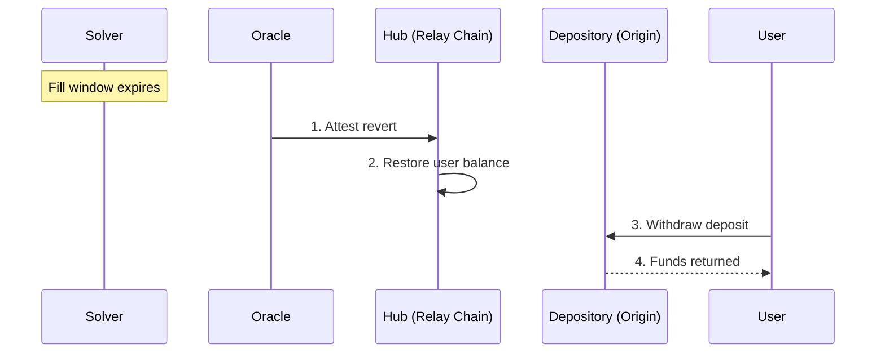

## Architecture

The protocol consists of four core components:

| Component | Role | Location |
|-----------|------|----------|
| [**Depository**](/references/protocol/components/depository) | Holds user deposits on each origin chain | Every supported chain (80+) |
| [**Oracle**](/references/protocol/components/oracle) | Verifies deposits and fills, attests to the Hub | Off-chain service |
| [**Hub**](/references/protocol/components/hub) | Tracks token ownership and solver balances | Relay Chain |
| [**Allocator**](/references/protocol/components/allocator) | Generates withdrawal proofs for solvers | Relay Chain / MPC |

These components are supported by the [Relay Chain](/references/protocol/components/relay-chain), a purpose-built settlement chain where the Hub contract lives and all settlement operations are processed. The [Security Council](/references/protocol/components/security-council) governs the Allocator with the ability to pause, unpause, or replace it in an emergency.

## Flows

Every crosschain order in Relay passes through three sequential flows: **Execution**, **Settlement**, and **Withdrawal**.

### Execution Flow

Execution is the user-facing part of the process. The user deposits funds on the origin chain, and a solver fills their order on the destination chain.

**Step by step:**

1. **User requests a quote** — The user specifies what they want (e.g., bridge 1 ETH from Optimism to Base). The Relay API returns quotes from available solvers.

2. **User deposits into Depository** — The user sends funds to the [Depository](/references/protocol/components/depository) contract on the origin chain. The deposit is tagged with an **orderId** that links it to the solver's commitment. This costs approximately 21,000 gas — close to a simple transfer.

3. **Solver fills on destination** — The solver detects the deposit and executes the user's requested action on the destination chain using their own capital. The fill can be a simple transfer, a swap, or any arbitrary onchain action.

<Tip>
Because deposits go to the Depository (not to the solver directly), user funds are protected. If the solver fails to fill, the user can reclaim their deposit.
</Tip>

### Settlement Flow

Settlement is the process of verifying that the solver correctly filled the order, and crediting them on the Hub.

**Step by step:**

1. **Oracle reads origin chain** — The [Oracle](/references/protocol/components/oracle) reads the origin chain to verify that the user's deposit occurred and matches the expected order.

2. **Oracle reads destination chain** — The Oracle reads the destination chain to verify that the solver's fill matches the user's intent (correct destination, amount, and action).

3. **Oracle attests to the Hub** — The Oracle signs an EIP-712 attestation and submits it to the [Hub](/references/protocol/components/hub) contract on the [Relay Chain](/references/protocol/components/relay-chain). This attestation triggers two actions:
   - **MINT** — The user's deposit is represented as a token balance on the Hub
   - **TRANSFER** — That balance is transferred from the user to the solver

4. **Solver balance updated** — The solver's balance on the Hub increases, reflecting the payment they are owed for the fill.

<Info>
Settlement happens in real-time, per-order. There is no batching window. As soon as the Oracle verifies a fill, the solver's balance is updated on the Hub.
</Info>

### Withdrawal Flow

Withdrawal is how solvers extract funds from the Depository to replenish their capital. Solvers accumulate balances on the Hub and can withdraw from any origin chain at any time.

**Step by step:**

1. **Solver requests withdrawal** — The solver specifies which chain and asset they want to withdraw from, and the amount.

2. **Allocator verifies balance** — The [Allocator](/references/protocol/components/allocator) checks the solver's balance on the Hub to confirm they have sufficient funds.

3. **Allocator generates proof** — The Allocator creates a chain-specific cryptographic proof (EIP-712 signature for EVM chains, Ed25519 for Solana) authorizing the withdrawal from the Depository on the target chain.

4. **Solver submits proof** — The solver submits the signed proof to the [Depository](/references/protocol/components/depository) contract on the target chain.

5. **Depository releases funds** — The Depository verifies the signature, confirms the nonce hasn't been used, and transfers the funds to the solver.

6. **Hub balance reduced** — The Hub burns the corresponding token balance (via a BURN action from the Oracle), keeping the ledger in sync.

<Tip>
Solvers choose their own withdrawal strategy. They can withdraw frequently to maximize capital velocity, or batch withdrawals to minimize transaction costs. The Hub balance accrues in real-time regardless.
</Tip>

### Revert Flow

If a solver fails to fill an order within the expected timeframe, the user's funds are protected and can be returned.

**Step by step:**

1. **Order expires** — If the solver doesn't fill within the commitment window, the order is marked as expired.

2. **Oracle attests revert** — The Oracle verifies that the fill did not occur and attests a revert to the Hub.

3. **User balance restored** — The Hub restores the user's token balance, effectively unlocking their deposit.

4. **User withdraws** — The user (or the protocol on their behalf) can trigger a withdrawal from the Depository to reclaim their funds.
