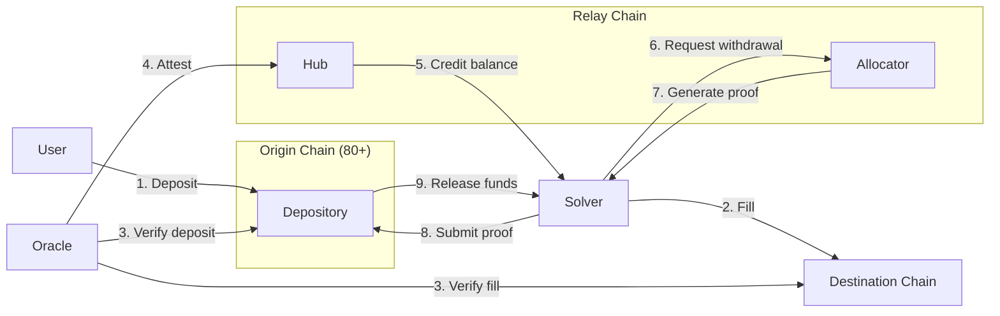

## Introduction

Relay Settlement is a crosschain intent settlement protocol designed for high-throughput payments across blockchains. It connects users to solvers who fill crosschain orders using their own capital, and then settles those orders on the [Relay Chain](/references/protocol/relay-chain) — a dedicated, low-cost settlement chain.

The protocol minimizes gas costs on origin and destination chains, enables rapid chain expansion, and maximizes capital efficiency for solvers — all while remaining non-custodial and verifiable.

<Info>
Relay Settlement powers the [Relay](https://relay.link) app and API. Most integrators use the [Relay API](/api-reference) rather than interacting with the protocol directly, but the protocol is open and permissionless.
</Info>

## How Crosschain Relaying Works

Crosschain intent protocols like Relay use liquidity providers known as _solvers_ to "fast fill" user requests. Rather than waiting for slow canonical bridges, solvers front their own capital on the destination chain, and then claim payment from the user's escrowed deposit on the origin chain.

This design has two key advantages:

- **Speed** — Solvers can fill optimistically without waiting for chain finality, completing orders in seconds
- **Cost** — Expensive bridge operations are batched and amortized, keeping per-order costs low

The typical flow for intent-based protocols is:

1. User **deposits** funds into escrow on the origin chain
2. Solver **fills** the order on the destination chain
3. Solver **settles** the order to claim payment

Where protocols differ is in *how* they handle settlement — the process of verifying fills and releasing payment. This is where Relay introduces significant improvements.

## What Makes Relay Different

Most intent protocols settle on the origin chain, which means gas costs grow with every order. Relay takes a fundamentally different approach:

**Settlement happens on a dedicated hub chain, not on the origin.**

Instead of proving every fill back to the origin chain, Relay uses an [Oracle](/references/protocol/components/oracle) to verify fills off-chain and attest to a central [Hub](/references/protocol/components/hub) on the [Relay Chain](/references/protocol/relay-chain). Solvers accrue balances on the Hub and can withdraw from any origin chain at any time.

This architecture enables:

- **~21,000 gas deposits** — Users pay close to a raw transfer cost (vs ~77,000 for typical escrow)
- **Zero-overhead fills** — Solvers can fill with a simple transfer, no contract interaction needed on destination
- **Real-time settlement** — Every order settles individually and immediately (vs 4-hour batch windows)
- **Capital efficiency** — Solvers get paid in seconds, not hours
- **Instant chain expansion** — Adding a chain requires deploying a single Depository contract

## Architecture Overview

The protocol consists of four core components that work together:

| Component | Role | Location |
|-----------|------|----------|
| [**Depository**](/references/protocol/components/depository) | Holds user deposits on each origin chain | Every supported chain (80+) |
| [**Oracle**](/references/protocol/components/oracle) | Verifies deposits and fills, attests to the Hub | Off-chain service |
| [**Hub**](/references/protocol/components/hub) | Tracks token ownership and solver balances | Relay Chain |
| [**Allocator**](/references/protocol/components/allocator) | Generates withdrawal proofs for solvers | Relay Chain / MPC |

These components are supported by the [Relay Chain](/references/protocol/relay-chain), a purpose-built settlement chain where the Hub contract lives and all settlement operations are processed.

## The Three Flows

Every crosschain order passes through three flows. Read the full walkthrough in [How It Works](/references/protocol/how-it-works).

### Execution

The user deposits funds into the [Depository](/references/protocol/components/depository) on the origin chain. A solver detects the order and fills it on the destination chain using their own capital.

### Settlement

The [Oracle](/references/protocol/components/oracle) reads both chains to verify the deposit and fill occurred correctly. It attests this to the [Hub](/references/protocol/components/hub) on the Relay Chain, which credits the solver's balance.

### Withdrawal

The solver requests a withdrawal from the [Allocator](/references/protocol/components/allocator), which generates a cryptographic proof. The solver submits this proof to the [Depository](/references/protocol/components/depository) on the origin chain to claim the user's deposited funds.

## Source Code

All protocol components are open source on [GitHub](https://github.com/relayprotocol/):

- [`settlement-protocol`](https://github.com/relayprotocol/settlement-protocol) — Hub, Oracle, and Allocator contracts
- [`relay-depository`](https://github.com/relayprotocol/relay-depository) — Depository contracts (EVM + Solana)
