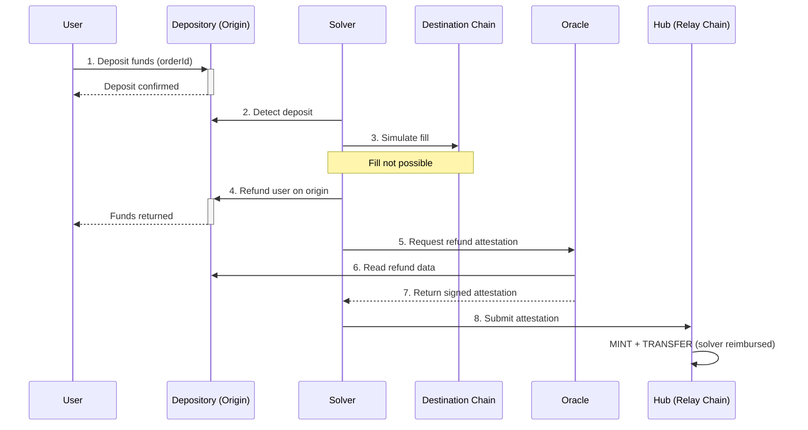
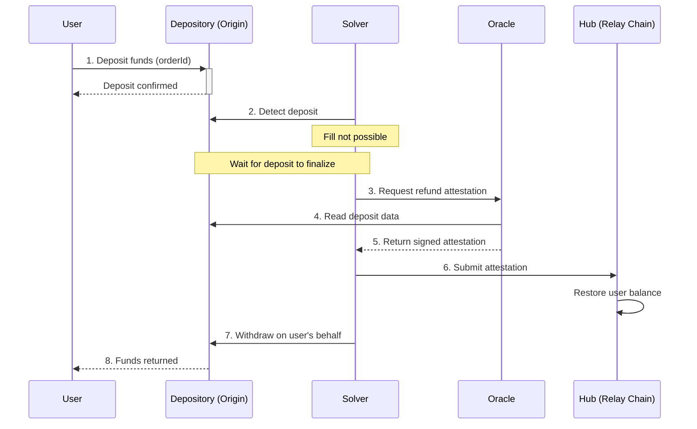
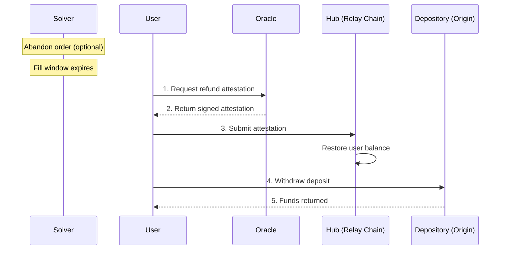

## Fast Refund

If a solver can't fill an order on the destination, they can instantly refund the user on the origin chain. The refund mirrors the execution flow — the solver detects the deposit and acts — but instead of filling on the destination, they return funds to the user on the origin. The refund is then settled like any other fill.

**Step by step:**

1. **User deposits into Depository** — The user deposits funds into the [Depository](/references/protocol/components/depository) on the origin chain, tagged with an **orderId**.

2. **Solver detects deposit** — The solver detects the deposit and evaluates whether it can fill the order.

3. **Solver simulates fill** — The solver simulates the fill on the destination chain and determines it can't be completed (e.g., insufficient liquidity, contract error).

4. **Solver refunds on origin** — Instead of filling, the solver sends funds directly to the user on the origin chain, returning them immediately.

5. **Solver requests attestation** — The solver calls the [Oracle](/references/protocol/components/oracle) to request a refund attestation.

6. **Oracle reads origin chain** — The Oracle reads the origin chain to verify the refund occurred and matched the order's requirements.

7. **Oracle returns attestation** — Validators sign and return the attestation to the solver.

8. **Solver submits to Hub** — The solver submits the attestation to the [Hub](/references/protocol/components/hub), which mints and transfers the balance to the solver — the same settlement process as a fill.

<Tip>
Fast refunds are the quickest way to return user funds. Because the solver acts immediately on the origin chain, the user doesn't need to wait for any expiry window.
</Tip>

## Slow Refund

If a solver can't fill but the deposit hasn't finalized yet on the origin chain, the solver waits for finalization before triggering the refund on the user's behalf. This is slower than a fast refund but still doesn't require user action.

**Step by step:**

1. **User deposits into Depository** — The user deposits funds into the [Depository](/references/protocol/components/depository) on the origin chain, tagged with an **orderId**.

2. **Solver detects deposit** — The solver detects the deposit and determines it can't fill the order.

3. **Solver requests refund attestation** — After the deposit finalizes on the origin chain, the solver calls the [Oracle](/references/protocol/components/oracle) to request a refund attestation.

4. **Oracle reads origin chain** — The Oracle reads the origin chain to verify the deposit and confirm the order was not filled.

5. **Oracle returns attestation** — Validators sign and return the attestation to the solver.

6. **Solver submits to Hub** — The solver submits the attestation to the [Hub](/references/protocol/components/hub), which restores the user's balance.

7. **Solver withdraws on user's behalf** — The solver triggers a withdrawal from the [Depository](/references/protocol/components/depository), returning the user's original deposit.

8. **User receives funds** — The funds are returned to the user on the origin chain.

<Info>
Slow refunds require the solver to wait for the deposit to finalize on the origin chain before initiating the refund. This adds latency but the user doesn't need to take any action.
</Info>

## Self Refund

If a solver fails to fill **and** doesn't refund, the user's funds are still protected. After the order's fill window expires, the user can trigger a self refund to reclaim their deposit. Solvers can also **abandon** an order early, which shortens the expiry window and allows the self refund to happen faster.

**Step by step:**

1. **User requests refund** — After the fill window expires (or after the solver abandons), the user calls the [Oracle](/references/protocol/components/oracle) to request a refund attestation. If the solver knows they can't fill, they can **abandon** the order early — this signals intent to not fill and shortens the expiry window so the user gets their funds back faster.

2. **Oracle returns attestation** — The Oracle verifies that the fill did not occur and returns a signed attestation to the user.

3. **User submits to Hub** — The user submits the attestation to the [Hub](/references/protocol/components/hub), which restores their token balance.

4. **User withdraws** — The user (or the protocol on their behalf) triggers a withdrawal from the [Depository](/references/protocol/components/depository) to reclaim their funds.
